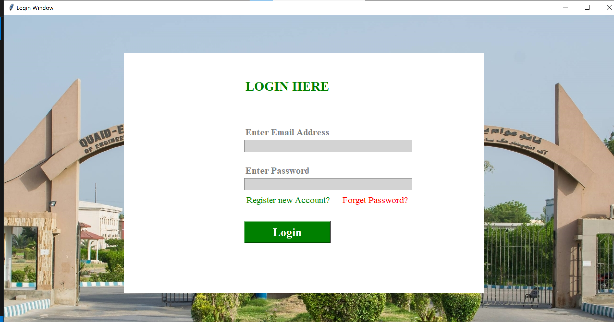
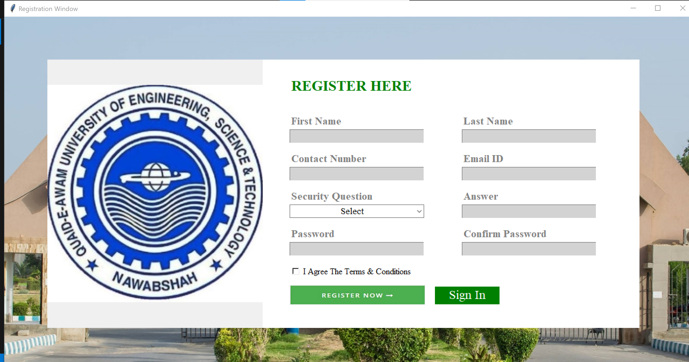
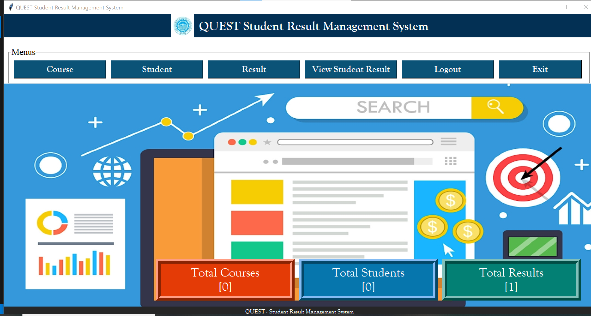

**Student Result Management System**

The Student Result Management System is a user-friendly application designed to streamline the process of managing and accessing student academic records. This system enables administrators, teachers, and students to efficiently store, retrieve, and analyze academic performance data in a secure and organized manner.

**Key Features**

User Authentication: Secure login for administrators, teachers, and students.
Student Information Management: Easily add, update, and manage student details.
Result Entry and Storage: Input and store examination results for multiple subjects and terms.
Automated Calculations: Calculate total marks, averages, and grades automatically.
Report Generation: Generate detailed student performance reports in printable formats.
Search and Filter: Quickly find student results using filters like name, roll number, or class.
Error Handling: Alerts for invalid entries or missing data to maintain data integrity.

**Benefits**

Reduces manual effort in managing student data.
Ensures data accuracy and minimizes errors in result calculations.
Provides quick access to academic records for stakeholders.
Enhances transparency and accessibility for students and parents.

**Login**

**Registration Page**

**Dashboard**

